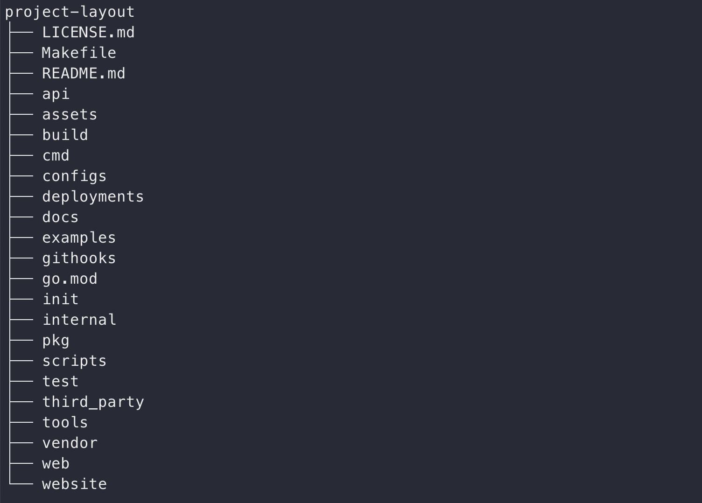

# Go Web 专题

## 写在前面

文中主要会涉及到以下几个公共仓库：

- [gin](https://github.com/gin-gonic/gin): HTTP 框架
- [gorm](https://github.com/go-gorm/gorm): ORM 框架
- [go-redis](https://github.com/go-redis/redis)：go语言 redis 客户端
- [stretchr/testify](https://github.com/stretchr/testify): 单元测试框架
- [golang/mock](https://github.com/golang/mock): 单元测试框架

以下部分来自掘金技术社区的 **Draveness** 博文 ———— [如何写出优雅的 Golang 代码
](https://juejin.cn/post/6844903856405495822#heading-12)

## 目录结构

目录结构基本上就是一个项目的门面，很多时候我们从目录结构中就能够看出开发者对这门语言是否有足够的经验，所以在这里首先要介绍的就是如何在 Go 语言的项目或者服务中组织代码。

官方并没有给出一个推荐的目录划分方式，很多项目对于目录结构的划分也非常随意，这其实也是没有什么问题的，但是社区中还是有一些比较常见的约定，例如：[golang-standards/project-layout](https://github.com/golang-standards/project-layout) 项目中就定义了一个比较标准的目录结构。



### /pkg

这个目录中存放的就是项目中可以被外部应用使用的代码库，其他的项目可以直接通过 `import` 引入这里的代码，所以当我们将代码放入 `pkg` 时一定要慎重。

### /internal

私有代码推荐放到 `/internal` 目录中，真正的项目代码应该写在 `/internal/app` 里，同时这些内部应用依赖的代码库应该在 `/internal/pkg` 子目录和 `/pkg` 中。

当我们在其他项目引入包含 `internal` 的依赖时，Go 语言会在编译时报错：

``` bash
An import of a path containing the element “internal” is disallowed
if the importing code is outside the tree rooted at the parent of the 
"internal" directory.
```

这种错误只有在被引入的 `internal` 包不存在于当前项目树中才会发生，如果在同一个项目中引入该项目的 internal 包并不会出现这种错误。

### /cmd

`/cmd` 目录中存储的都是当前项目中的可执行文件，该目录下的每一个子目录都应该包含我们希望有的可执行文件，如果我们的项目是一个 `grpc` 服务的话，可能在 `/cmd/server/main.go` 中就包含了启动服务进程的代码，编译后生成的可执行文件就是 `server`。

### /api

`/api` 目录中存放的就是当前项目对外提供的各种不同类型 (OpenAPI/Swagger 规范、JSON 模式文件、协议定义文件) 的 `API` 接口定义文件，其中可能包含类似 `/api/protobuf-spec`、`/api/thrift-spec` 或者 `/api/http-spec` 的目录，这些目录中包含了当前项目对外提供的和依赖的所有 `API` 文件。

### Makefile

最后要介绍的 `Makefile` 文件也非常值得被关注，在任何一个项目中都会存在一些需要运行的脚本，这些脚本文件应该被放到 `/scripts` 目录中并由 `Makefile` 触发，将这些经常需要运行的命令固化成脚本减少『祖传命令』的出现。

### 补充

在 Go 语言的项目最不应该有的目录结构其实就是 `/src` 了，社区中的一些项目确实有 `/src` 文件夹，但是这些项目的开发者之前大多数都有 Java 的编程经验，这在 Java 和其他语言中其实是一个比较常见的代码组织方式，但是作为一个 Go 语言的开发者，我们不应该允许项目中存在 `/src` 目录。

## 模块拆分

我们既然已经介绍过了如何从顶层对项目的结构进行组织，接下来就会深入到项目的内部介绍 Go 语言对模块的一些拆分方法。

Go 语言的一些顶层设计最终导致了它在划分模块上与其他的编程语言有着非常明显的不同，很多其他语言的 Web 框架都采用 MVC 的架构模式，例如 Rails 和 Spring MVC，Go 语言对模块划分的方法就与 Ruby 和 Java 完全不同。

### 按层拆分

无论是 Java 还是 Ruby，它们最著名的框架都深受 [MVC架构模式](https://draveness.me/mvx/) 的影响，我们从 Spring MVC 的名字中就能体会到 MVC 对它的影响，而 Ruby 社区的 Rails 框架也与 MVC 的关系非常紧密，这是一种 Web 框架的最常见架构方式，将服务中的不同组件分成了 Model、View 和 Controller 三层。


### 按职责拆分

Go 语言在拆分模块时就使用了完全不同的思路，虽然 MVC 架构模式是在我们写 Web 服务时无法避开的，但是相比于横向地切分不同的层级，Go 语言的项目往往都按照职责对模块进行拆分：


对于一个比较常见的博客系统，使用 Go 语言的项目会按照不同的职责将其纵向拆分成 post、user、comment 三个模块，每一个模块都对外提供相应的功能，post 模块中就包含相关的模型和视图定义以及用于处理 API 请求的控制器（或者服务。

```sh
$ tree pkg
pkg
├── comment
├── post
│   ├── handler.go
│   └── post.go
└── user
```

Go 语言项目中的每一个文件目录都代表着一个独立的命名空间，也就是一个单独的包，当我们想要引用其他文件夹的目录时，首先需要使用 `import` 关键字引入相应的文件目录，再通过 pkg.xxx 的形式引用其他目录定义的结构体、函数或者常量，如果我们在 Go 语言中使用 `model`、`view` 和 `controller` 来划分层级，你会在其他的模块中看到非常多的 `model.Post`、`model.Comment` 和 `view.PostView`。

这种划分层级的方法在 Go 语言中会显得非常冗余，并且如果对项目依赖包的管理不够谨慎时，很容易发生引用循环，出现这些问题的最根本原因其实也非常简单：

1. Go 语言对同一个项目中不同目录的命名空间做了隔离，整个项目中定义的类和方法并不是在同一个命名空间下的，这也就需要工程师自己维护不同包之间的依赖关系。
2. 按照职责垂直拆分的方式在单体服务遇到瓶颈时非常容易对微服务进行拆分，我们可以直接将一个负责独立功能的 `package` 拆出去，对这部分性能热点单独进行扩容。

## books API 项目
